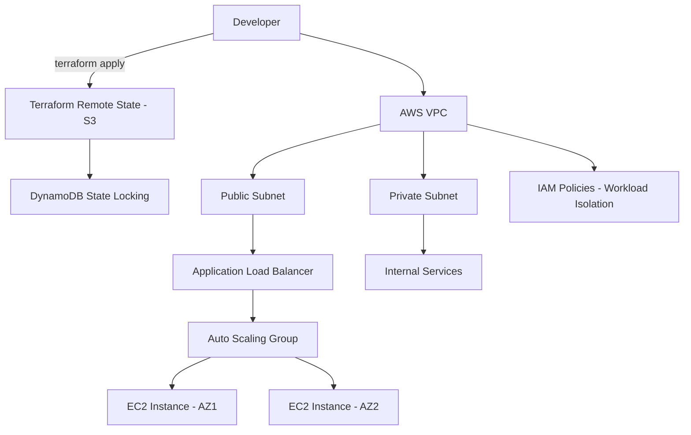
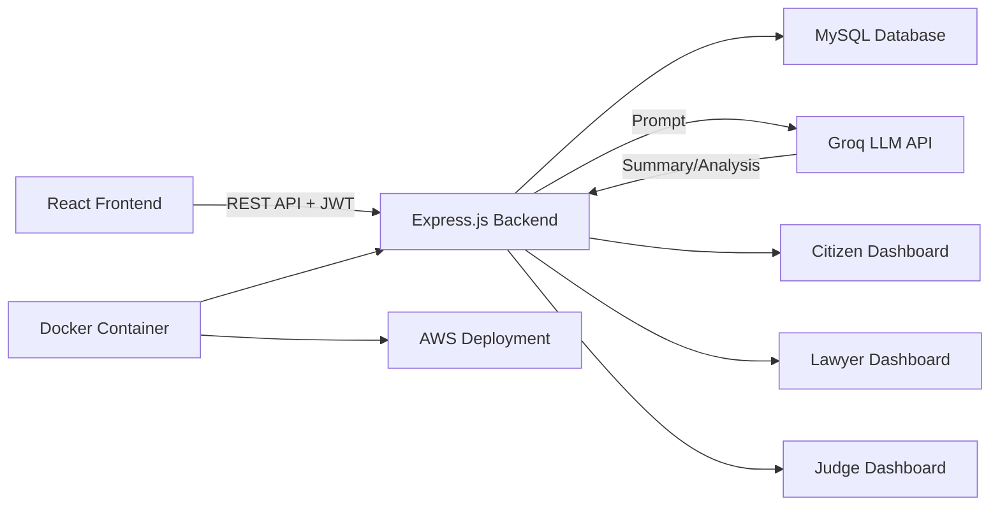
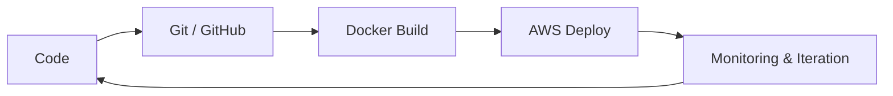

<div align="center">


<br>

<a href="https://linkedin.com/in/gaurav-sonawane-510062233">
  
</a>

<br><br>


</div>

<br>

## 🧑‍💻 About Me

I'm a fresh Computer Engineering graduate (2025) building **cloud-native, AI-integrated systems** — from production-style AWS infrastructure with Terraform to full-stack applications powered by LLMs via the Groq API.

I care about three things: infrastructure that scales cleanly, code that's readable six months later, and AI that's integrated with purpose — not bolted on for a demo.

- 🎓 B.E. Computer Engineering — Shree Chhatrapati Shivaji Maharaj COE, Maharashtra
- ☁️ Hands-on with AWS multi-tier architecture, Terraform IaC, and Docker
- 🤖 Integrating Groq LLM APIs into legal-tech, ed-tech, and civic-tech platforms
- 💼 Fresher, actively seeking **Cloud / AI Engineer** or **Full-Stack Developer** roles

<br>

## 🎯 Current Focus

> 🔭 Deepening AWS cloud security and CI/CD pipelines
> 🌱 Exploring Generative AI patterns beyond single-shot prompting (RAG, agentic workflows)
> 🤝 Open to collaborating on open-source Cloud/DevOps tooling
> 📫 Reach me at **sonawneg123@gmail.com**

<br>

## 🚀 Featured Projects

<table>
<tr>
<td width="50%" valign="top">

### ⚖️ Nyaya Sahayak
**AI Legal Assistant Platform**

Role-based multilingual legal platform with citizen, lawyer, and judge dashboards. Groq LLM API interprets and summarizes legal documents, cutting manual review effort.

`React.js` `Node.js` `Express.js` `MySQL` `Groq API` `JWT` `AWS` `Docker`

</td>
<td width="50%" valign="top">

### 🏫 AI Classroom Portal
**Automated Evaluation Platform**

AI-driven classroom platform for assignment upload and automated grading via Groq API, with teacher analytics and PDF report generation.

`React.js` `Node.js` `Express.js` `MySQL` `AWS` `Groq API`

</td>
</tr>
<tr>
<td width="50%" valign="top">

### 🌆 Community Hero AI
**Civic Issue Reporting Platform**

Geolocation-based civic reporting with Google Maps integration. Groq API auto-categorizes and summarizes issues for municipal triage.

`React.js` `Node.js` `Express.js` `MySQL` `AWS` `Google Maps API` `Groq API`

</td>
<td width="50%" valign="top">

### ☁️ AWS Terraform Infrastructure
**Production-Style Multi-Tier Cloud Network**

Public/private subnets, IAM isolation, Auto Scaling behind an ALB across multiple AZs. Remote state in S3 with DynamoDB state locking.

`Terraform` `AWS EC2/VPC/IAM/ALB` `S3` `DynamoDB`

</td>
</tr>
</table>

<details>
<summary><b>📐 View Architecture — AWS Terraform Infrastructure</b></summary>



</details>

<details>
<summary><b>📐 View Architecture — Nyaya Sahayak (AI Legal Assistant)</b></summary>



</details>

<br>

## 🧰 Tech Stack

### Languages & Frontend
<p>

</p>

### Backend & Databases
<p>

</p>

### AI Stack
| Skill | Tools |
|---|---|
| LLM Integration | Groq API |
| Techniques | Prompt Engineering, Generative AI |
| Application | Document summarization, auto-categorization, automated evaluation |

<p>  </p>

### Cloud Stack
| Category | Services |
|---|---|
| Compute & Networking | EC2, VPC, ALB, Auto Scaling |
| Serverless | Lambda, API Gateway |
| Storage & Data | S3, DynamoDB, CloudFront |
| Security & IAM | IAM policies, workload isolation |
| IaC | Terraform (remote state, state locking, modular config) |
| Other Platforms | Azure & GCP fundamentals |

<p>

</p>

### DevOps Stack
<p>

</p>



<br>

## 📊 GitHub Analytics

<div align="center">


<br><br>

### 🐍 Contribution Snake


<sub>Snake animation auto-generates via GitHub Actions once <a href="https://github.com/Platane/snk">Platane/snk</a> is set up in this repo — see setup note below.</sub>

</div>

<br>

## 🗓️ Career Journey

```
2021  ── Started B.E. Computer Engineering
2024  ── Web Developer Intern @ Cloud Infotech
              Built 5+ full-stack apps with React, Node.js, Express, MySQL/MongoDB
2025  ── Graduated B.E. Computer Engineering
              Shifted focus to Cloud (AWS + Terraform) and LLM integration
2025  ── Built 3 production-style full-stack + AI projects
              Nyaya Sahayak, AI Classroom Portal, Community Hero AI
Now   ── Actively job hunting: Cloud / AI Engineer roles
              Deepening Cloud Security, CI/CD, and Generative AI patterns
```

<br>

## 🛣️ Roadmap

<table>
<tr>
<td width="50%" valign="top">

**2026**
- [ ] AWS Certified Solutions Architect – Associate
- [ ] Build a CI/CD pipeline with GitHub Actions for all featured projects
- [ ] Contribute to 3+ open-source repositories
- [ ] Learn Kubernetes fundamentals
- [ ] Land first full-time Cloud/AI Engineer role

</td>
<td width="50%" valign="top">

**2027**
- [ ] Explore RAG and agentic AI architectures in production
- [ ] AWS Certified DevOps Engineer – Professional
- [ ] Publish technical writeups on Cloud + AI integration
- [ ] Mentor junior developers / contribute to a maintained OSS project
- [ ] Design a multi-cloud (AWS + GCP/Azure) reference architecture

</td>
</tr>
</table>

<br>

## 🌍 Open-Source Goals

| Goal | Status |
|---|---|
| First merged PR to a public repository | 🔲 In progress |
| Maintain a public Terraform module | 🔲 Planned |
| Contribute to an AI/LLM tooling project | 🔲 Planned |
| Publish a starter template (Cloud + AI stack) | 🔲 Planned |

<br>

## 📫 Connect With Me

<div align="center">

<a href="https://linkedin.com/in/gaurav-sonawane-510062233"></a>
<a href="mailto:sonawneg123@gmail.com"></a>
<a href="https://github.com/sonawneg123"></a>

</div>

<br>

<div align="center">


<sub>⭐ Thanks for visiting — always open to connecting on Cloud, DevOps, and AI Engineering.</sub>
</div>
